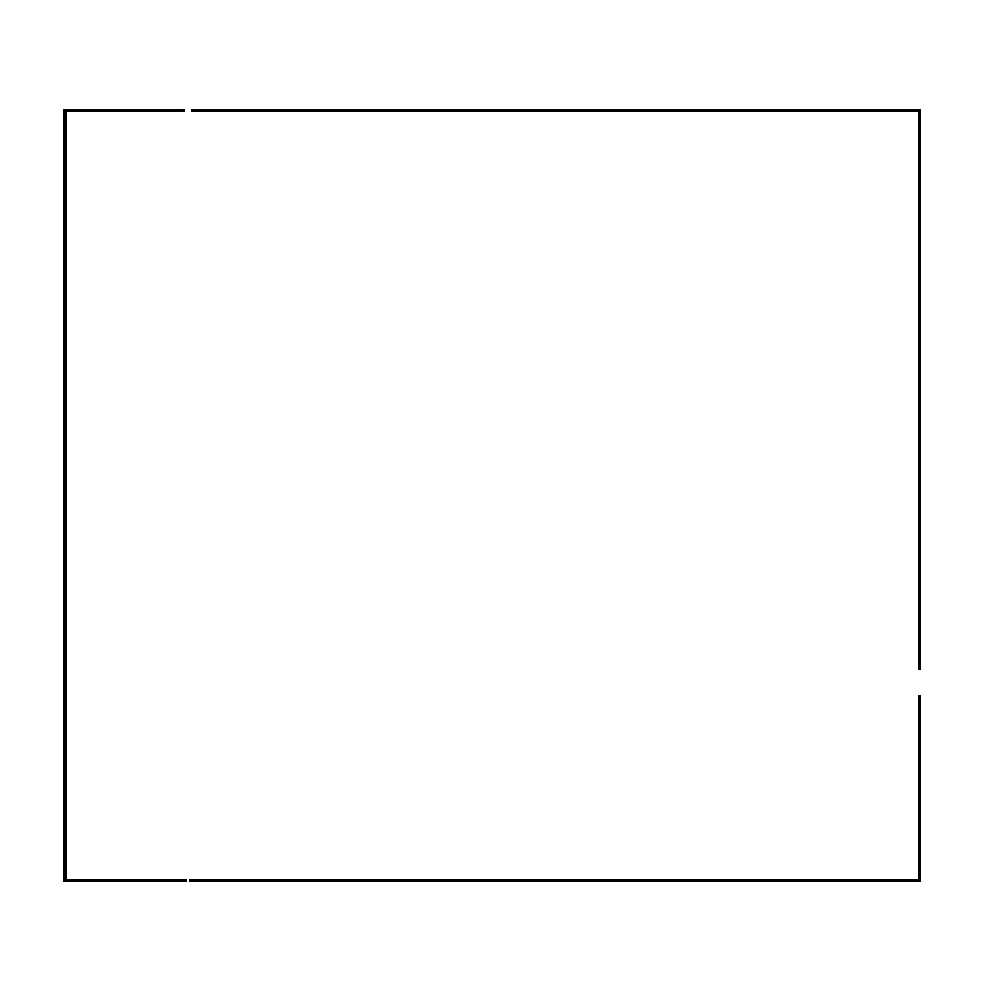
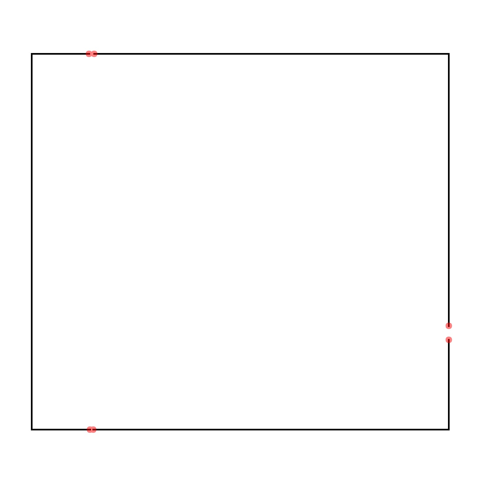

## Overview
I set out to develop a solution for detecting and highlighting line breaks in images, particularly with blueprints and schematics in mind. Manually scanning an image for such defects can be time-consuming and may overlook subtle line breaks. This script serves as a proof of concept, that can be further developed for specific use cases. In this iteration, since a line break consists of two endpoints, the script identifies and highlights the endpoints of lines in the selected image. Future iterations could incorporate filtering methods to exclude intentional endpoints (such as those forming icons or symbols) to enhance accuracy.

## Created With
| Name | Version |
| --- | --- |
| [Python](https://www.python.org/) | 3.12.4 |
| [OpenCV Contrib Python](https://pypi.org/project/opencv-contrib-python/)| 4.11.0.86 |
| [Numpy](https://pypi.org/project/numpy/) | 2.2.3 |
## Example

### Before:

### After:

